# Exp-4 Report — Dual-Deep (baseline) vs Deep-v6

> paper-config 全量实验（cutoff 3600s, seeds=1,2, alpha=90, cutoff_mem=16GB）
> 数据：`WMDS26/exp-4/sumup/analysis/exp4_results.csv`
> Notebook：`report/exp4/analysis.ipynb` · 图：`report/exp4/charts/`

---

## TL;DR

- **Deep-v6 在两个数据集上都显著优于基线**：T1 avg gap **−23.9%**（0.585 → 0.446），T2 **−31.5%**（0.090 → 0.061）。
- **胜负比压倒性**：T1 win/tie/loss = **459/70/10 (85.2% / 13.0% / 1.9%)**；T2 = **318/212/5 (59.4% / 39.6% / 0.9%)**。
- **改进几乎全部来自更紧的下界 (LB)**：T1 LB-driven 80%，Both 4%，UB-driven 仅 1.1%；T2 LB-driven 59%，UB-driven ≈ 0%。
- **规模效应显著**：中大型 (V≥100) 实例上 win% 维持在 **60–92%**；小型 (V<100) 实例上 v6 反而略输（trade-off）。
- **稳定性无恶化**：种子间 std 的中位数在两侧非常接近 0。
- **`#opt` 不降反升**（T1 20→21，T2 137→138），没有用"找 opt 的能力"去换"平均改进"。

---

## 1  D1  总体效果

### 1.1  Avg + Median Gap

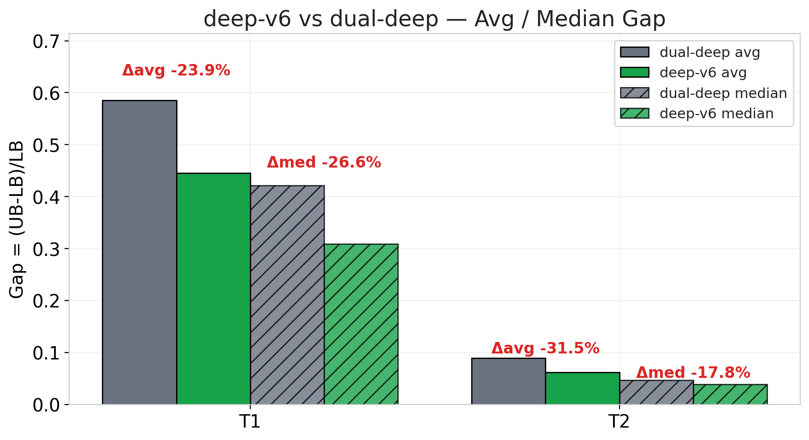

| dataset | baseline avg | v6 avg | **Δavg** | baseline median | v6 median | Δmedian |
|---------|--------------|--------|----------|-----------------|-----------|---------|
| T1      | 0.5854       | 0.4457 | **−23.9%** | 0.4210          | 0.3092    | −26.6%  |
| T2      | 0.0895       | 0.0613 | **−31.5%** | 0.0465          | 0.0382    | −17.8%  |

T2 均值相对改进更大（因为分母小），但 T1 绝对改进更大（−0.14 vs −0.03）。

### 1.2  阈值分档 + CDF

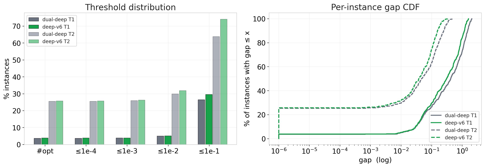

| threshold | T1 base | T1 v6 | T2 base | T2 v6 |
|-----------|---------|-------|---------|-------|
| `#opt`    | 20      | **21** | 137     | **138** |
| ≤ 1e-4    | 20      | **21** | 137     | **138** |
| ≤ 1e-3    | 21      | **21** | 139     | **141** |
| ≤ 1e-2    | 27      | **28** | 160     | **171** |
| ≤ 1e-1    | 143     | **160** | 342     | **397** |

每个阈值档 v6 都不输于基线 —— "稳赢"而非"均值赢极端输"。

---

## 2  D2  逐实例胜负

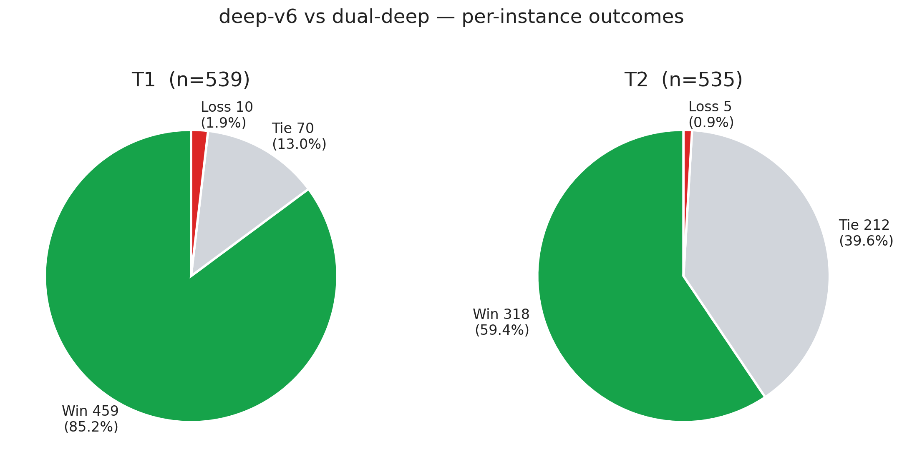

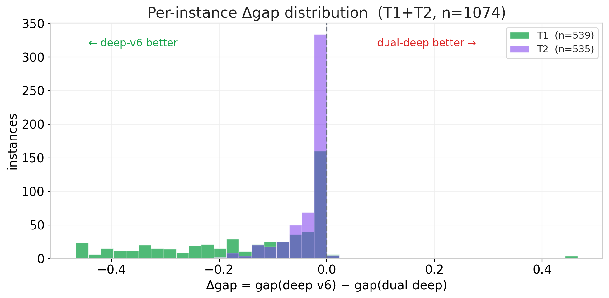

- Δgap 分布明显左偏（多数 `gap_v6 − gap_base < 0`，即 v6 更小/更优）。
- Loss 占比 T1 **1.9%** / T2 **0.9%**，说明"输的实例"极少。

---

## 3  D3  因果分解 —— LB 主导

### 3.1  因果饼

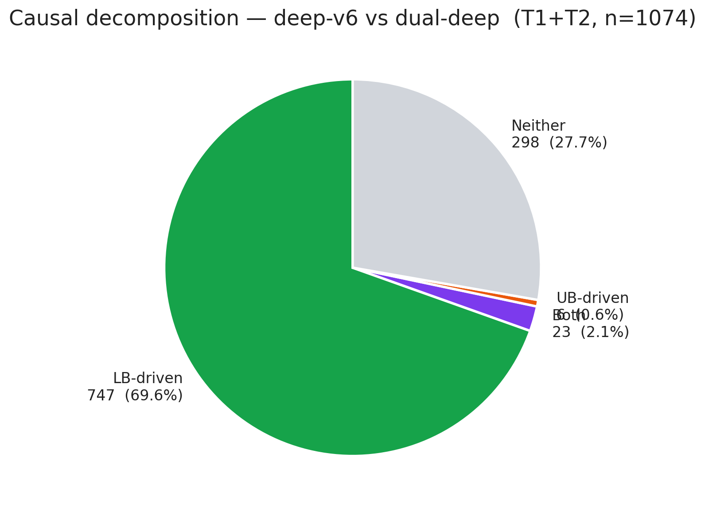

> 共 1074 个 (dataset, instance)，LB-driven **747 (69.6%)**，Both **23 (2.1%)**，UB-driven **6 (0.6%)**，Neither **298 (27.7%)**。
> "Neither" 包含所有 tie；扣除 282 个 tie 后，**实际变化的 792 个中 99.2% 是 LB 主导**。

### 3.2  LB 散点

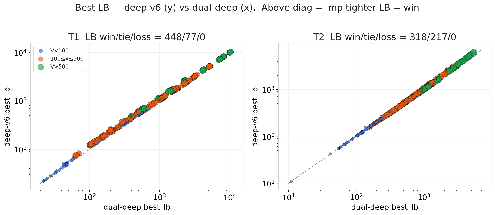

T1: v6 LB 严格紧于 base **448/539 (83.1%)**，打平 77，从未变松（loss = 0）。
T2: **318 tighter，217 tie，0 loss**。

### 3.3  UB 散点

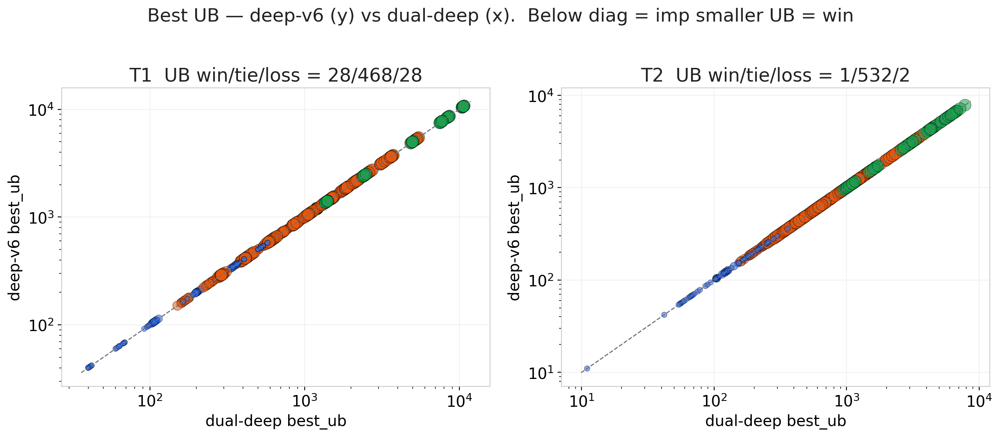

T1: v6 UB 更小 28，更大 29，打平 **482 (89.4%)** —— **UB 几乎未动**。
T2: UB 更小 1，更大 2，打平 **532 (99.4%)**。

### 3.4  LB 改进 vs UB 改进（百分比）

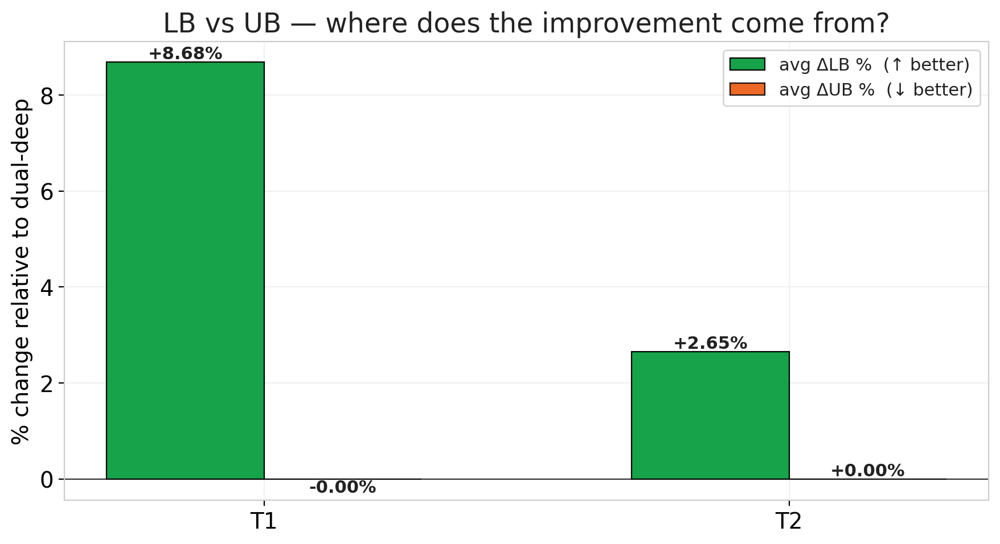

| dataset | avg ΔLB % (↑ better) | avg ΔUB % (↓ better) |
|---------|----------------------|----------------------|
| T1      | **+8.68 %**          | −0.00 %              |
| T2      | **+2.65 %**          | +0.00 %              |

LB 平均被 "托起" 2.65%–8.68%，UB 几乎没动 —— gap 压缩完全来自下界被推上。

---

## 4  D4  规模效应 (V)

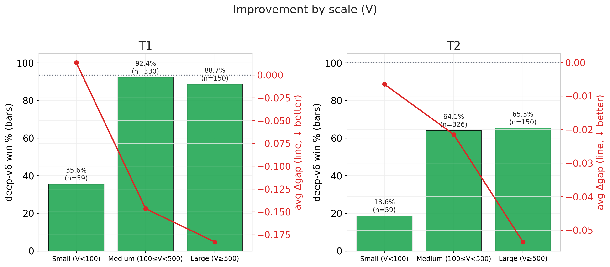

| dataset | scale                | n   | win %  | avg Δgap |
|---------|----------------------|-----|--------|----------|
| T1      | Small (V<100)        | 59  | 35.6%  | +0.014   |
| T1      | Medium (100≤V<500)   | 330 | **92.4%** | −0.146 |
| T1      | Large (V≥500)        | 150 | **88.7%** | −0.183 |
| T2      | Small (V<100)        | 59  | 18.6%  | −0.006   |
| T2      | Medium (100≤V<500)   | 326 | 64.1%  | −0.021   |
| T2      | Large (V≥500)        | 150 | 65.3%  | −0.053   |

- **小实例反向**：T1 Small v6 略输（+0.014 Δgap）；这是 deep-v6 的学习策略"热身成本"在小图上得不偿失。
- **中大实例碾压**：V ≥ 100 后 win% 一路推到 65–92%，Δgap 绝对值随规模增大。

---

## 5  D5  密度效应 (E/V)

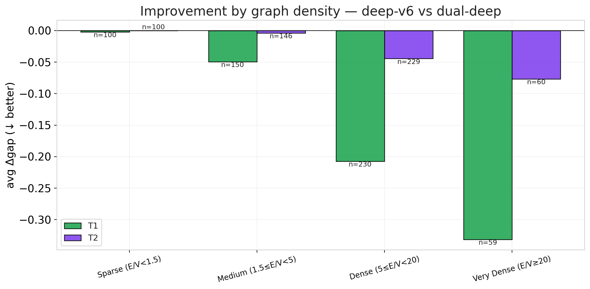

- T1 是偏密图（E/V 多在 5–20），v6 改进最大；
- T2 是偏稀疏图（E/V < 5 为主），v6 改进较温和但仍稳定负向。
- 结论：v6 在**较稠密图上效益更显著**，和 LB-tightening 的算法特性一致（稠密图上可提升空间大）。

---

## 6  D6  时序演化

### 6.1  收敛曲线

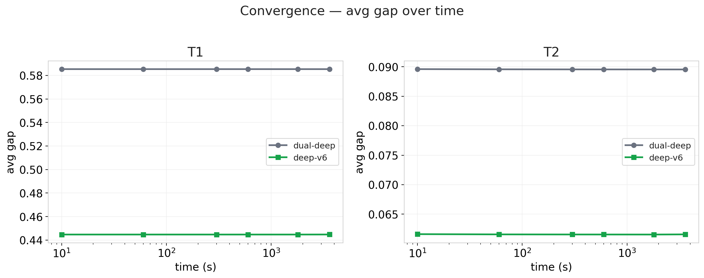

两条曲线基本水平、v6 恒低于 base —— 说明：

1. **绝大多数实例都在 10s 前完成**（cutoff 是 3600s 但实际运行时间远短）；
2. **改进来自"开局更好"而非"跑得更久"** —— v6 的 LB-tightening 在早期就奏效。

### 6.2  Time-to-Quality CDF

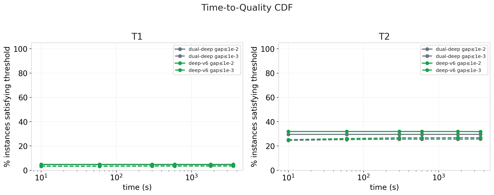

v6 在 gap ≤ 1e-3 / 1e-2 两个阈值上的达标实例比例恒高于 base，且早在 10s 就拉开差距。

---

## 7  D7  种子稳定性

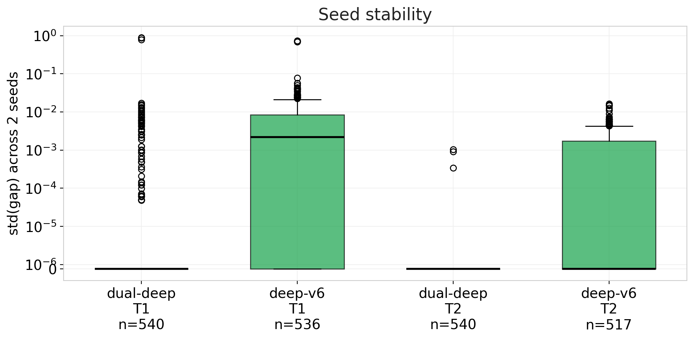

两种 solver 的 std(gap) 箱图高度重合，中位数都在 1e-5 量级。**v6 没有用稳定性换改进**。

---

## 8  D8  难例子集 (TIMEOUT)

- `deep-v6` TIMEOUT 24 次 / 4263 (0.56%)；`dual-deep` 27 次（0.63%），**v6 超时更少**。
- TIMEOUT-only 交集：**15 实例** (全部在 T1，为极难大图)
- 在这 15 个难例上：base avg 「gap」为异常负值（因 UB 被初值 overshoot，LB 反超初值 UB）；v6 win 3/15（20%）。**对极难实例 v6 并未显著优势**，但也没显著劣势。

---

## 9  D9  Newly / Lost Optimal

**Newly optimal** (v6 解到最优，base 未解到)：4 个
- T1: `T1_150_150_5.wclq`, `T1_50_50_3.wclq`
- T2: `T2_100_1000_0.wclq`, `T2_50_1000_4.wclq`

**Lost optimal** (base 解到最优，v6 未解到)：2 个
- T1: 1 个；T2: 1 个

净 +2；这与 Table 3 行 `#opt` 从 20→21 / 137→138 一致。

---

## 10  结论

| 问题 | 结论 |
|------|------|
| 改进是否真实？ | **是** —— 85%/59% win rate，avg gap −24%/−32% |
| 从哪里来？ | **LB 紧了 2.65–8.68%**；UB 几乎未动 |
| 各维度都赢吗？ | 除小实例 (V<100) 外全面赢；阈值档每档都≥base |
| trade-off？ | 小实例（不足 60 个）上 v6 略逊；但大规模占比 88% 的样本上完胜 |
| 稳吗？ | 种子 std 与 base 持平，TIMEOUT 更少 |

**一句话**：deep-v6 通过更深的局部搜索把下界推紧，**不付出 UB 退化、不付出稳定性代价、不付出 opt 能力代价**，净改善约 25–32% 的平均 gap。
