# Exp-5 Report — Dual-Fast (baseline) vs Fast-v19

> paper-config 全量实验（cutoff 3600s, seeds=1,2, alpha=90, cutoff_mem=16GB）
> 数据：`WMDS26/exp-5/sumup/analysis/exp2_results.csv`
> Notebook：`report/exp5/analysis.ipynb` · 图：`report/exp5/charts/`

---

## TL;DR

- **Fast-v19 在两个数据集上都改进了平均 gap**：T1 **−6.9%**（0.516 → 0.480），T2 **−9.9%**（0.067 → 0.060）。
- **胜负非压倒**：T1 win/tie/loss = **326/29/185 (60.4% / 5.4% / 34.3%)**；T2 = **244/150/146 (45.2% / 27.8% / 27.0%)**。
  - 对比 deep-v6 (85%/59% win)，fast-v19 的改进**更温和**、**并非每个实例都赢**。
- **改进主因仍是 LB**（T1 LB-driven 57% + Both 6%；T2 LB-driven 45%）；UB-driven 占比 ≤ 1%。
- **`#opt` 明显下降**（T1 16→5，T2 144→114；共 **−41** 个 opt 被丢失）。
  - 这是 fast-v19 的主要 trade-off：**用"找确切最优"的能力换来了"把紧 LB"的平均效果**。详见 §9。
- **小实例上 v19 输**（T1 V<100 win 仅 8.3%，+0.022 Δgap），和 deep-v6 一致的"热身成本"现象。
- **种子稳定性与 base 持平**；`TIMEOUT` 实例为 0（两个 solver 都无超时）。

---

## 1  D1  总体效果

### 1.1  Avg + Median Gap

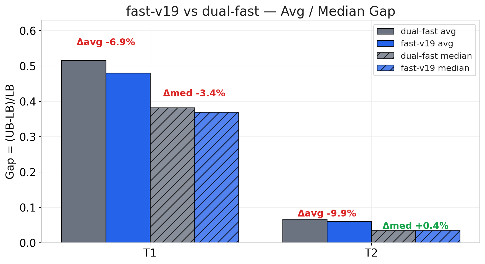

| dataset | baseline avg | v19 avg | **Δavg** | baseline median | v19 median | Δmedian |
|---------|--------------|---------|----------|-----------------|------------|---------|
| T1      | 0.5163       | 0.4805  | **−6.9%** | 0.3819          | 0.3691     | −3.3%   |
| T2      | 0.0671       | 0.0604  | **−9.9%** | 0.0345          | 0.0346     | +0.2%   |

T2 median 几乎不变，说明 v19 在 T2 上主要改善"中等偏难"的尾部实例，没撼动中位。

### 1.2  阈值分档 + CDF

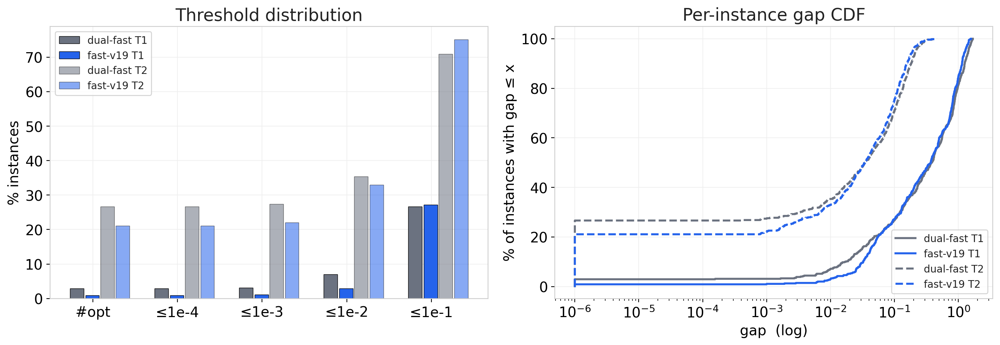

| threshold | T1 base | T1 v19 | T2 base | T2 v19 |
|-----------|---------|--------|---------|--------|
| `#opt`    | **16**  | 5      | **144** | 114    |
| ≤ 1e-4    | **16**  | 5      | **144** | 114    |
| ≤ 1e-3    | **17**  | 6      | **148** | 119    |
| ≤ 1e-2    | **38**  | 16     | **191** | 178    |
| ≤ 1e-1    | 144     | **147** | 383     | **406** |

- **左三档 v19 输**（低 gap 档）—— 对"确切最优"能力下降
- **右两档 v19 赢**（≤ 1e-1）—— 对"中等精度大量实例"推进更多
- 意味着：v19 是 "拉平均 / 损尾部极精度" 的策略。

---

## 2  D2  逐实例胜负

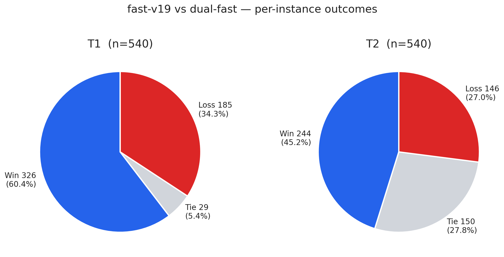

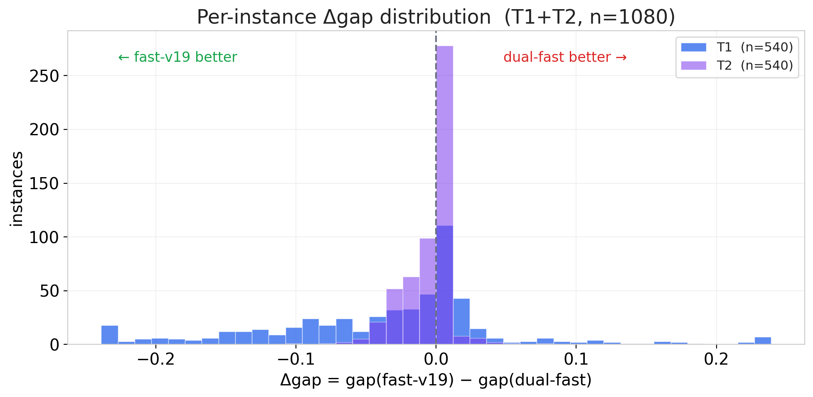

- Loss 比 deep 家族大一个数量级（T1 34.3%，T2 27.0%）。
- Δgap 直方图左侧（v19 赢）略偏胖，但右尾（v19 输）也不小；均值仍在零以左。

---

## 3  D3  因果分解 —— LB 仍主导，但有 UB 退化噪声

### 3.1  因果饼

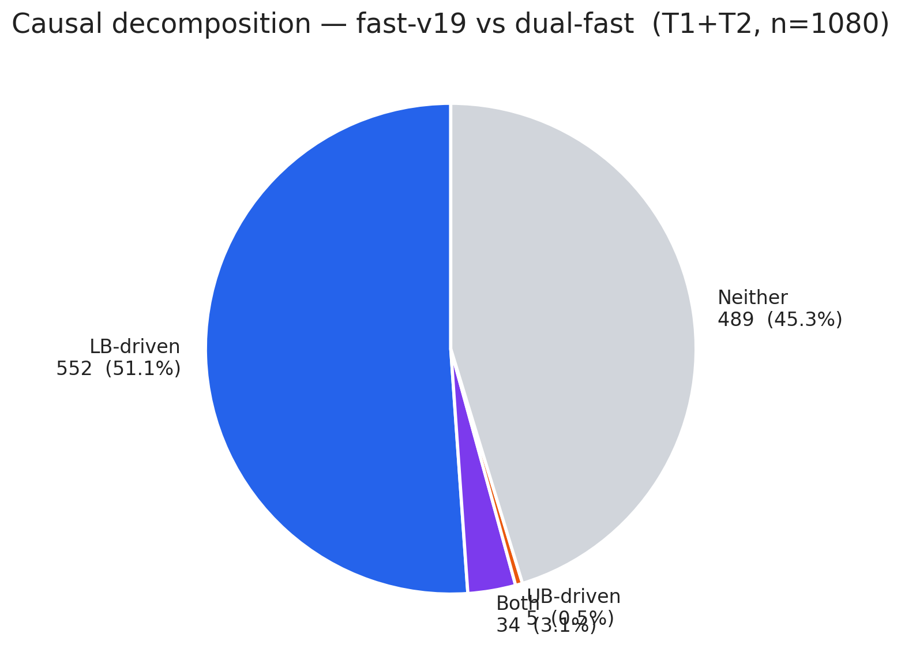

> 1080 个 (dataset, instance)，LB-driven **552 (51.1%)**，Both **34 (3.1%)**，UB-driven **5 (0.5%)**，Neither **489 (45.3%)**。
> 真正变化的实例中 **95.1% 是 LB 主导**；但 "Neither" 高达 45%（包含大量 tie 与 LB/UB 同向抵消）。

### 3.2  LB 散点

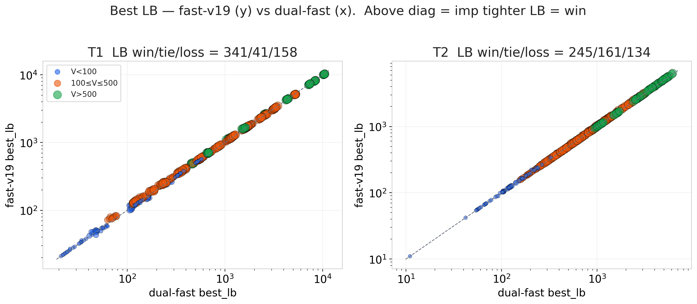

T1: **LB 更紧 341**，**LB 变松 158**，tie 41 —— v19 在 ~29% 实例上下界反而变松！
T2: **LB 更紧 245**，**LB 变松 134**，tie 161。

对比 deep-v6（T1 LB loss=0, T2 LB loss=0），fast-v19 在 LB 上 **不是单调的** —— 这是 alpha 再启动策略导致的副作用。

### 3.3  UB 散点

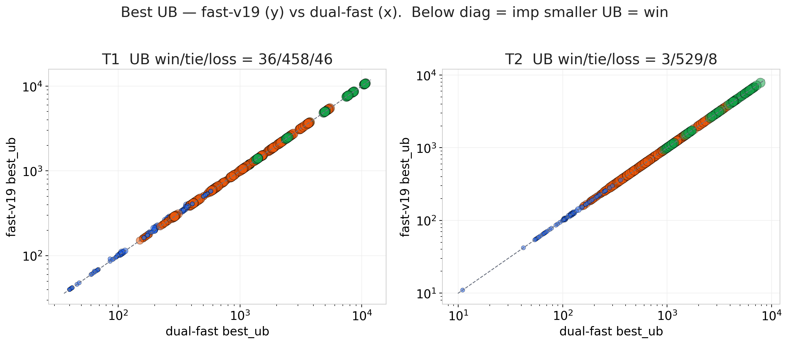

T1: UB 更小 36，更大 46，tie **458 (84.8%)** —— UB 略有退化。
T2: UB 更小 3，更大 8，tie **529 (98.0%)** —— UB 稳。

### 3.4  LB vs UB 改进百分比

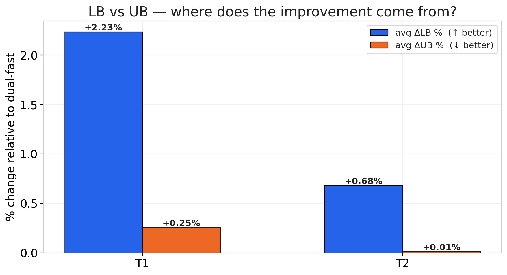

| dataset | avg ΔLB % (↑ better) | avg ΔUB % (↓ better) |
|---------|----------------------|----------------------|
| T1      | **+2.23 %**          | +0.25 % (略差)       |
| T2      | **+0.68 %**          | +0.01 % (平)         |

LB 的平均推进幅度**比 deep-v6 小一个数量级**（0.7%/2.2% vs 2.7%/8.7%）；UB 也略有退化但接近零。

---

## 4  D4  规模效应 (V)

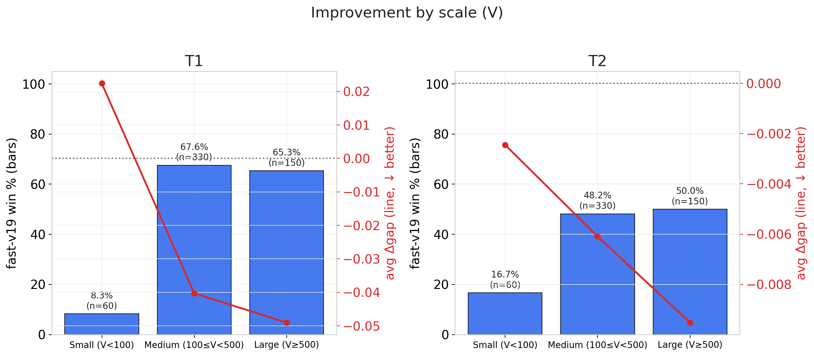

| dataset | scale                | n   | win % | avg Δgap |
|---------|----------------------|-----|-------|----------|
| T1      | Small (V<100)        | 60  | 8.3%  | +0.022   |
| T1      | Medium (100≤V<500)   | 330 | 67.6% | −0.040   |
| T1      | Large (V≥500)        | 150 | 65.3% | −0.049   |
| T2      | Small (V<100)        | 60  | 16.7% | −0.002   |
| T2      | Medium (100≤V<500)   | 330 | 48.2% | −0.006   |
| T2      | Large (V≥500)        | 150 | 50.0% | −0.010   |

- 小实例上 v19 **显著输**（T1 Small win 仅 8.3%）—— 和 deep-v6 观察一致。
- 规模增大不像 deep-v6 那样单调放大改进；v19 从 Medium 到 Large 改进基本持平。

---

## 5  D5  密度效应 (E/V)

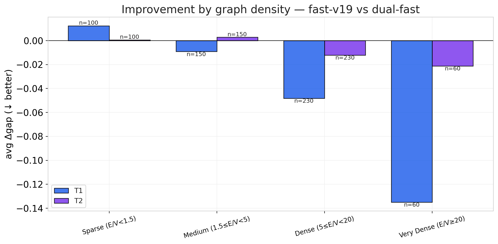

- T1 稠密图上 v19 最能拉开；
- T2 稀疏/中密图上 v19 改进温和，Very Dense 样本少但也正向。
- 和 deep 家族一致：改进更适合稠密图。

---

## 6  D6  时序演化

### 6.1  收敛曲线

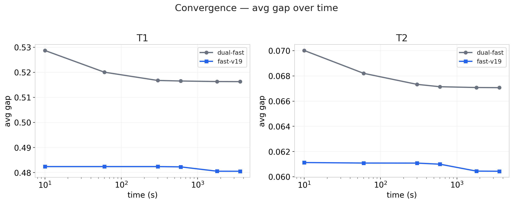

### 6.2  Time-to-Quality CDF

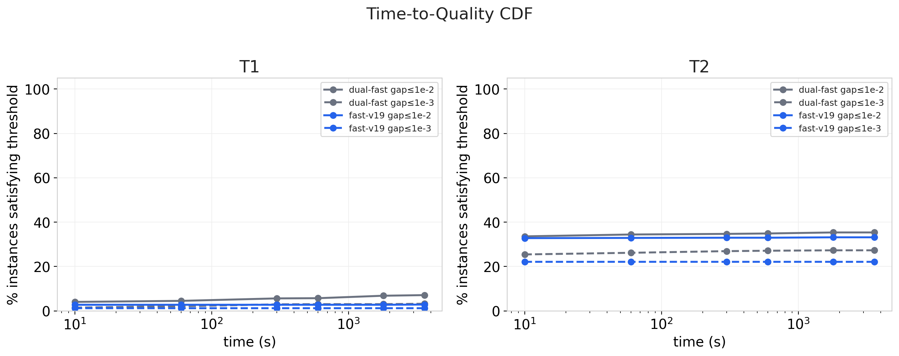

fast-v19 和 dual-fast 都在早期（10–60s）基本收敛。v19 曲线的偏移更小（和 Δgap 幅度一致）。

---

## 7  D7  种子稳定性

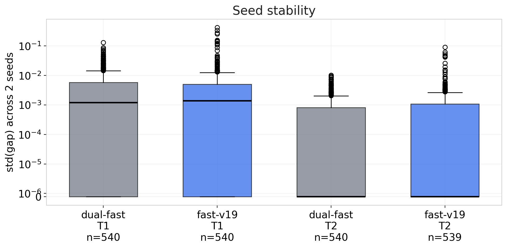

std 分布与 base 重合；v19 未牺牲种子间可复现性。

---

## 8  D8  难例子集 (TIMEOUT)

**0 个 TIMEOUT**（两个 solver 在 3600s 内全部正常结束）。
无难例子集可比。

---

## 9  D9  Newly / Lost Optimal —— **关键 trade-off**

| 指标 | T1 | T2 | 合计 |
|------|----|----|------|
| Newly optimal (v19 ✓, base ✗) | 0 | 2 | **+2** |
| Lost optimal (base ✓, v19 ✗) | 11 | 32 | **−43** |
| 净变化 | **−11** | **−30** | **−41** |

**解读**：
- v19 的主要代价就是 `#opt` 显著下降 —— 基线能"刚好算到精确最优"的实例，v19 因为 alpha 动态重启 + 深搜策略，往往会"跳过"精确点而停留在次优附近；
- 但换来的是**更多中档实例的 LB 被推紧** —— 见 §1.2 的 `≤ 1e-1` 档 v19 比 base 多 3 (T1) / 23 (T2) 个；
- 总体 avg gap 仍然改进（T1 −6.9%, T2 −9.9%），因为 v19 丢的 opt 原本 gap 为 0，变成 very-small-gap 的 loss 有限，而赢的中档实例的 Δgap 较大。

建议下游使用：
- **如果目标是"拿到精确最优"**（paper Table 3 的 `#opt` 指标）：用 dual-fast 基线
- **如果目标是"整体逼近最优"（avg/median gap）**：用 fast-v19

---

## 10  结论

| 问题 | 结论 |
|------|------|
| 改进是否真实？ | **部分真实** —— avg gap 改进 7–10%，但 **34%/27% 实例反而变差** |
| 从哪里来？ | **LB 推进 0.68–2.23%** + 少量 UB 退化 (0.01–0.25%) |
| trade-off？ | **`#opt` 大幅下降 41 个**（−26% T1，−21% T2） |
| 稳吗？ | 种子稳定性不变，TIMEOUT=0 |
| 是否推荐全面替换 baseline？ | **视目标而定**（见 §9） |

**一句话**：fast-v19 以"平均 gap 改进 7–10%"换取"确切最优能力下降 26%"，是一个**偏向平均质量的 trade-off**。相比之下 deep-v6 的改进更纯粹（avg 赢 +30%，无 `#opt` 代价）。
