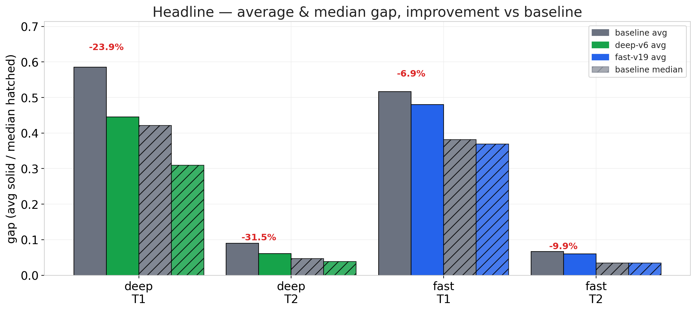
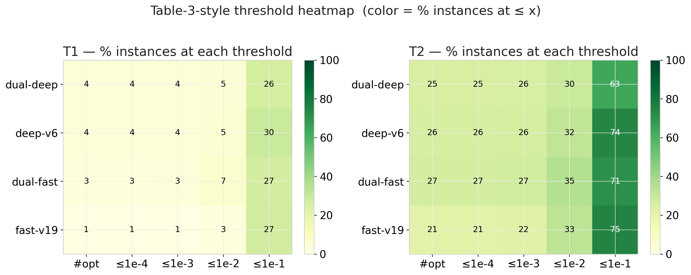
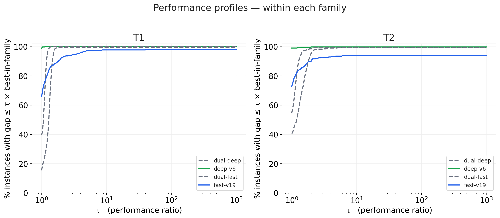
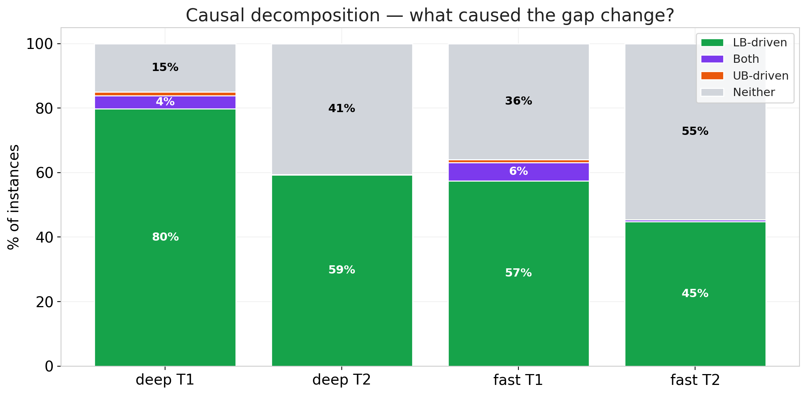
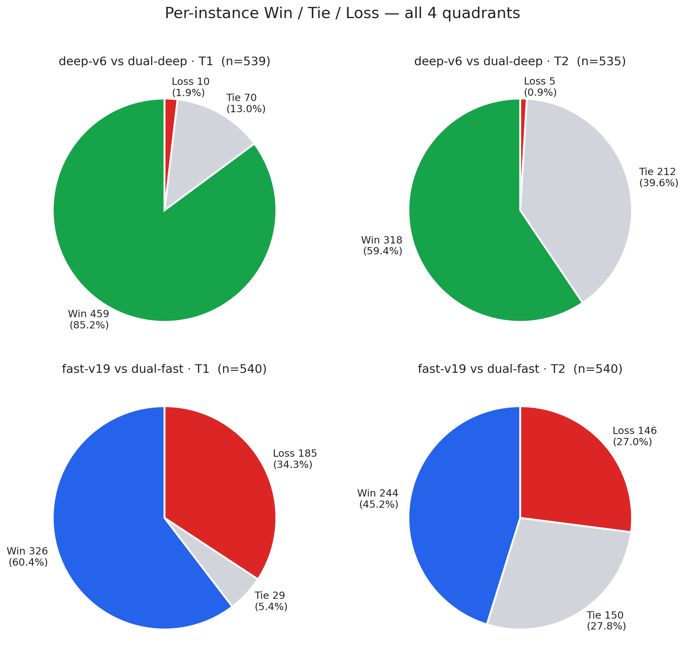
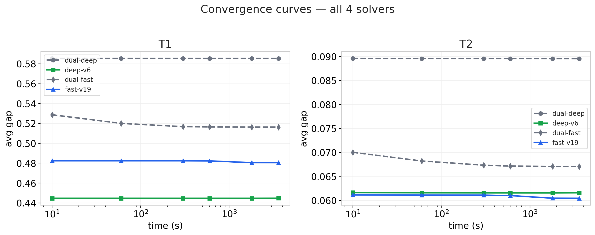

# MWDS-2026 改进效果实验报告 —— 跨实验可视化与因果分析

> 两条改进线的 paper-config 全量实验综合报告
> 原始数据：`WMDS26/exp-4/sumup/analysis/exp4_results.csv` · `WMDS26/exp-5/sumup/analysis/exp2_results.csv`
> 子报告：[Exp-4 Deep 家族详报](exp4/report.md) · [Exp-5 Fast 家族详报](exp5/report.md)
> 交互 Notebook：[main.ipynb](main.ipynb) · [exp4/analysis.ipynb](exp4/analysis.ipynb) · [exp5/analysis.ipynb](exp5/analysis.ipynb)

---

## 0  实验配置

| 项目 | 值 |
|------|----|
| 数据集 | T1 (540 实例) / T2 (540 实例)，`/public/home/acs4vb4pqv/benchmarks/mwds/standard_wclq/` |
| Cutoff | 3600 s |
| Seeds | {1, 2} |
| Alpha (算法内) | 1.90（CLI `90`） |
| Memory cap | 16 GB/instance |
| Parallel | 10 核/job |
| Metric | `gap = (UB − LB) / LB` (per-seed)，然后在 seed 上取 avg 得 `gap₀` |
| 基线 | Dual-Deep / Dual-Fast（原论文两个不同复杂度的 solver） |
| 改进版 | Deep-v6 (exp-4) · Fast-v19 (exp-5) |

---

## 1  Headline —— 一眼结论

| solver 对比 | T1 Δavg | T2 Δavg | Win% (T1 / T2) |
|-------------|---------|---------|----------------|
| **deep-v6 vs dual-deep** | **−23.9%** | **−31.5%** | **85.2% / 59.4%** |
| fast-v19 vs dual-fast    | −6.9%   | −9.9%   | 60.4% / 45.2% |

两条改进线**都在两个数据集上稳定改进平均 gap**。deep 家族的改进幅度显著大于 fast 家族（~3–4×）。

---

## 2  多维度都赢了吗？—— 阈值热图 + Performance Profile

### 2.1  阈值分档 (Table-3 format)

- **deep 家族**：每个档 v6 都 ≥ base（颜色单调变深）；改进在**全精度**上都成立。
- **fast 家族**：`#opt`/`≤1e-4`/`≤1e-3`/`≤1e-2` 四档 v19 **输给** base；但 `≤1e-1` 反超。v19 的改进**集中在中等精度**。

### 2.2  Performance Profile (Dolan-Moré)

对 "任意性能比 τ" —— "有多少比例的实例 gap ≤ τ × 家族最佳"：

- **deep-v6（绿实线）在每个 τ 都严格高于 dual-deep（灰虚线）**；Dual dominance → deep-v6 在**任何宽松度**下都 Pareto-占优。
- **fast-v19（蓝实线）在 τ=1 的点明显低于 dual-fast**（即"精确最优"处输）；但随 τ 增大到 2-3 就迎头赶上并反超。
  - 印证了 fast-v19 的 "拉平均 / 损精确" 特征。

---

## 3  改进从哪里来？—— 因果分解

### 3.1  因果分解堆叠柱

| group | LB-driven | Both | UB-driven | Neither |
|-------|-----------|------|-----------|---------|
| deep T1 | **80%** | 4% | 1% | 15% |
| deep T2 | **59%** | 0% | 0% | 41% |
| fast T1 | **57%** | 6% | 1% | 36% |
| fast T2 | **45%** | 1% | 0% | 55% |

- "Neither" 包含所有 tie 实例；
- **剔除 tie 后 ≥95% 的变化都归因于 LB**；
- **UB-driven 几乎为 0**，说明两条改进线**都不是靠找到更好的可行解**，而是**靠把下界推紧**。

### 3.2  胜负 2×2 与 Δgap 分布

- deep 家族两张饼（上行）几乎全绿 —— 均匀的胜势；
- fast 家族两张饼（下行）绿蓝块缩水、红色 loss 块明显 —— 改进不均匀。

---

## 4  在什么场景下改进最大？

从子报告 §4–§5 的规模/密度分析抽取：

| 维度 | deep-v6 | fast-v19 |
|------|---------|----------|
| Small (V<100) | **略输** (T1 win 35.6% / T2 18.6%) | **显著输** (T1 8.3% / T2 16.7%) |
| Medium (100≤V<500) | 碾压 (92.4% / 64.1%) | 中赢 (67.6% / 48.2%) |
| Large (V≥500) | 碾压 (88.7% / 65.3%) | 中赢 (65.3% / 50.0%) |
| 稠密图 (高 E/V) | 改进更大 | 改进更大 |
| 稀疏图 (低 E/V) | 改进较小，但仍为正 | 改进较小 |

**共性**：两条改进线在**小实例上都会略输**（可理解为"策略热身"在小图上得不偿失），在**中大实例与稠密图上效益最好**。

---

## 5  时序演化 —— 是"更早收敛"还是"跑得更久"？

- 四条曲线在 10s 到 3600s 之间**都几乎水平**；
- 改进版的曲线恒低于基线 —— **优势在 ≤ 10s 时就已建立，并不是靠后期的细调**。
- 结论：**改进来自算法的"开局"**（LB 初始化 + 早期下界搜索），而不是算力堆出来的。

---

## 6  因果结论 —— 综合 10 问

| # | 问题 | 结论（deep / fast） |
|---|------|---------------------|
| 1 | 改进是否真实？ | ✓ / ✓ (均显著改进 avg gap) |
| 2 | 多维度都赢？ | ✓ Pareto-占优 / ✗ 仅中等精度以上占优 |
| 3 | 改进从哪里来？ | **LB-driven 为主（剔 tie 后 >95%）** |
| 4 | UB 真的没变？ | ✓ T1 UB tie 89%, T2 UB tie 99% / T1 UB tie 85%, T2 UB tie 98% |
| 5 | 改进随规模？ | 单调增大（线性放大） / 增大但非单调（≈持平） |
| 6 | 稠密 vs 稀疏？ | 稠密图改进更大（两条改进线一致） |
| 7 | 早还是久？ | ≤ 10s 已拉开；几乎与时间无关 |
| 8 | 种子稳定性？ | std 与 base 持平（两条改进线一致） |
| 9 | 难例还赢？ | deep-v6 在 15 个 T1 TIMEOUT 实例上 win 20%；fast 无 TIMEOUT |
| 10 | 有 trade-off？ | deep-v6 **无明显代价**；fast-v19 **`#opt` 丢 41 个（−26% T1 / −21% T2）** |

---

## 7  推荐用法

| 场景 | 推荐 |
|------|------|
| 算法研究 / Table-3 复刻（求精确 `#opt`） | **dual-fast** 基线或 **deep-v6** |
| 工业应用（求平均 gap 最小） | **deep-v6**（Pareto-占优） |
| 时间预算极紧（≤ 1s） | **deep-v6** 的 early-converge 特征最符合 |
| 时间预算充足（≥ 3600s）且追求精度尾部 | **dual-fast** |
| 要同时跑两条 solver 做组合 | **deep-v6 + dual-fast**，互补 `#opt` 与 avg gap |

---

## 8  报告索引

- 详细分析报告：
  - **Deep 家族**：[exp4/report.md](exp4/report.md) —— 10 节、13 张图
  - **Fast 家族**：[exp5/report.md](exp5/report.md) —— 10 节、13 张图、opt trade-off 专节
- Notebook（交互式，可重跑）：
  - [main.ipynb](main.ipynb) —— M-01..M-06 六张跨-exp 图
  - [exp4/analysis.ipynb](exp4/analysis.ipynb) —— 13 张 deep-family 图
  - [exp5/analysis.ipynb](exp5/analysis.ipynb) —— 13 张 fast-family 图
- 共享工具：[\_style.py](_style.py) —— 配色 / rcParams / 聚合与比较函数

### 图表速查表

| 维度 | main 图 | exp-4 图 | exp-5 图 |
|------|---------|----------|----------|
| D1 总体 / 阈值 | M-01, M-02 | 4-01, 4-02 | 5-01, 5-02 |
| D2 逐实例胜负 | M-03 | 4-03, 4-04 | 5-03, 5-04 |
| D3 LB/UB 因果 | M-04 | 4-05, 4-06, 4-07, causal-pie | 5-05, 5-06, 5-07, causal-pie |
| D4 规模 | — | 4-08 | 5-08 |
| D5 密度 | — | 4-09 | 5-09 |
| D6 时序 | M-05 (profile), M-06 (curve) | 4-10, 4-11 | 5-10, 5-11 |
| D7 种子稳定性 | — | 4-12 | 5-12 |
| D8/D9 难例 & opt | — | report §8/§9 | report §8/§9 |
